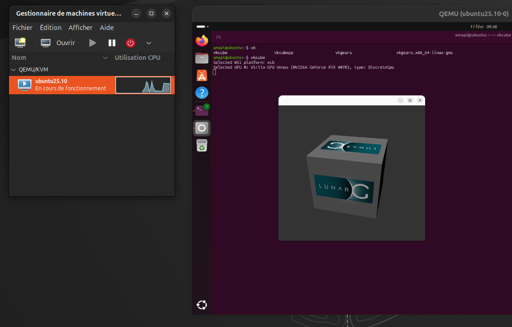

# Ubuntu VM with Vulkan/Venus 3D Acceleration



This repository documents the procedure to create a high-performance Ubuntu virtual machine on an Ubuntu host using **Libvirt**, **QEMU/KVM**, and **SDL**.

The primary goal of this setup is to enable **3D acceleration (Vulkan/OpenGL)** within the guest VM using the **Virtio-GPU Venus** protocol, while maintaining a refresh rate equivalent to the host via SDL display output.

## 🚀 Overview

Standard virtual machine displays (Spice/VNC) often lack proper 3D acceleration and suffer from input lag or low refresh rates. By utilizing QEMU's native SDL display and passing through the GPU capabilities via Venus, this configuration allows for:

* **Native-like Refresh Rates:** synchronized with the host GPU.
* **3D Acceleration:** Full Vulkan and OpenGL support inside the VM.
* **Wayland Support:** Optimized for modern Linux desktop environments.

## 📋 Prerequisites

* **Host OS:** Ubuntu 25.04 / 25.10 (Tested on 25.10).
* **Guest OS:** Ubuntu 25.10 (Linux guests only).
* **Privileges:** User must have `sudo` access.
* **Hardware:** Host GPU with Vulkan support.

## 📚 Documentation

The full step-by-step guide is available in the **[installation.md]()** file.

It covers:

1. **Host Preparation:** Installing necessary packages (QEMU, Libvirt, Virglrenderer) and configuring permissions (AppArmor, ACLs).
2. **VM Creation:** Initial setup using `virt-manager`.
3. **XML Editing:** Critical manual modifications via `virsh` to enable Venus and SDL, which are not currently supported by the `virt-manager` GUI.

## ⚠️ Known Limitations & Warnings

* **Clipboard Sharing:** Due to the use of the SDL display backend, the shared clipboard between Host and Guest **does not work**.
* **OS Support:** This method relies on Virtio-GPU Venus; it **does not work for Windows or macOS guests**.
* **Configuration Management:** Once configured, you **must use `virsh edit**` to manage the VM. Opening and saving the VM configuration in `virt-manager` will strip the custom XML tags and break the 3D acceleration setup.
* **Reboot Persistence:** Specific ACL commands must be re-run after every host reboot (see the automation section in the guide).

## 🛠️ Quick Command Reference

To edit the VM configuration (do not use the GUI):

```bash
virsh edit <vm-name>

```

To start the VM:

```bash
virsh start <vm-name>

```

## 📄 License

This documentation is provided "as is" as a basic procedure. Optimization and improvements are welcome.

---

**Author:** Baptiste XAXA

